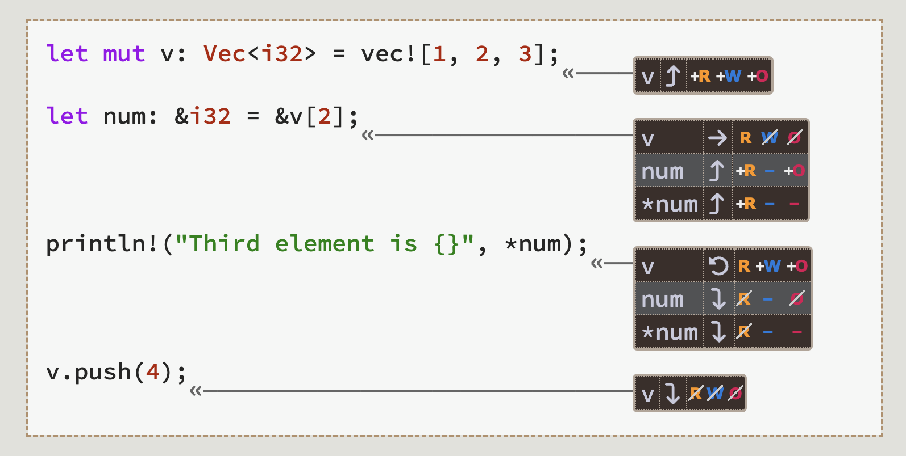

# Lecture 2

This lecture is about [Chap 4](https://rust-book.cs.brown.edu/ch04-00-understanding-ownership.html) to [6](https://rust-book.cs.brown.edu/ch06-00-enums.html) of the Rust book.

Watch videos: [Ownership](https://youtu.be/VFIOSWy93H0), [Structs](https://youtu.be/n3bPhdiJm9I), [Enums and Pattern Matching](https://youtu.be/DSZqIJhkNCM)

## Ownership

### Stack and heap

Read [Chap 4](https://rust-book.cs.brown.edu/ch04-01-what-is-ownership.html#ownership-as-a-discipline-for-memory-safety)

`Box` is used for putting data on heap. `let a = Box::new([0; 1_000_000]);` means a is a pointer, pointing to a array with 1_000_000 zeros (`let a = [0; 1_000_000];` has same effect, though).

### Move ownership

Read carefully about [this part](https://rust-book.cs.brown.edu/ch04-01-what-is-ownership.html#a-boxs-owner-manages-deallocation).

*The statement `let b = a` moves ownership of the box from `a` to `b`*

[*Variables Cannot Be Used After Being Moved*](https://rust-book.cs.brown.edu/ch04-01-what-is-ownership.html#variables-cannot-be-used-after-being-moved)

`.clone()` returns a copy. If it is a pointer to heap, clone also creates a copy of values in heap (deep copy).

### Reference and borrowing

[*References are non-owning pointers*](https://rust-book.cs.brown.edu/ch04-02-references-and-borrowing.html#references-are-non-owning-pointers)

You can even double borrowing.

```rust
fn main() {
    let m1 = String::from("Hello");
    let m2 = String::from("world");
    let m3 = &m1;
    let m4 = &m2;
    greet(&m3, &m4);
    let s = format!("{} {}", m3, m4); // Error: m1 and m2 are moved
}

fn greet(g1: &String, g2: &String) {
    println!("{} {}!", g1, g2);
}
```

#### Deference

```rust
// This snippet complies
fn main() {
    let mut x: Box<i32> = Box::new(1);
    let a: i32 = *x;         // *x reads the heap value, so a = 1
    *x += 1;                 // *x on the left-side modifies the heap value,
                            //     so x points to the value 2

    let r1: &Box<i32> = &x;  // r1 points to x on the stack
    let b: i32 = **r1;       // two dereferences get us to the heap value

    let r2: &i32 = &*x;      // r2 points to the heap value directly
    let c: i32 = *r2;    // so only one dereference is needed to read it
}
```

### Alias is dangerous

The following code doesn't compile. Because when `v.push(4)`, `v` may need reallocation and now it is at different address causing `num` pointing to an invalid address.

```rust
// This does NOT compile
fn main() {
    let mut v: Vec<i32> = vec![1, 2, 3];
    let num: &i32 = &v[2];
    v.push(4);
    println!("Third element is {}", *num);
}
```

***Pointer Safety Principle: data should never be aliased and mutated at the same time.***

### References Change Permissions on Places

Read [this](https://rust-book.cs.brown.edu/ch04-02-references-and-borrowing.html#references-change-permissions-on-places).

There are 3 permissions:

- Read (R): data can be copied to another location.
- Write (W): data can be mutated.
- Own (O): data can be moved or dropped.

*The key idea is that references can temporarily remove these permissions.*


### Move vs borrow

This cannot run, because ownership **moved** from `a` to `b`.

```rust
fn main() {
    let a = vec![3; 5];
    let mut b = a;
    b.push(2);
    println!("{:?}", b);
    // Cannot println!("{:?}", a); here. Because a doesn't own data now
}
```

This cannot run, because ownership is only **borrowed** by `b`.
> [!Note]
> But `b` do have permission "Write", `b` can be assigned to another `&Vec`. While `*b`, which is a immutable value (as declared in `let a = vec![3; 5];`), cannot be written!
> Please be careful about that. Take away: in this example, it is "`*b` cannot be written" makes "`b.push(2);` cannot be compiled". Not "`b` cannot be written".

```rust
fn main() {
    let a = vec![3; 5];
    let mut b = &a;
    b.push(2); // But if we comment out this line, it can run
    println!("{:?}", b);
}
```

```rust
fn main() {
    // Can compile
    let a = vec![3; 5];
    let mut b = &a;
    println!("{:?}", b);
    println!("{:?}", a); // a still owns data
}
```

### Copy trait

Not all types behave like this. Some types implements `Copy` trait, meaning that when you use `let b = a`, `a`'s value is **copied** to `b`! Moreover, for tuples, if all elements implement `Copy` trait, the tuple also has `Copy` trait.

```rust
fn main() {
    let a: (i32, i32) = (5, 1);
    let mut b = a;
    b.0 += 1;
    println!("{:?}", a); // (5, 1)
    println!("{:?}", b); // (6, 1)
}
```

```rust
use std::f64::consts::PI;

fn rotate(theta: f64, xy: &(f64, f64)) -> (f64, f64) { // Possible types for xy?
    let c = theta.cos();
    let s = theta.sin();
    // Overwrite xy with rotated xy
    
    let rotated: (f64, f64) = (
        c*xy.0 - s*xy.1,
        s*xy.0 + c*xy.1
    );
    rotated
}

fn main() {
    let pos: (f64, f64) = (1.0, -(3.0 as f64).sqrt());
    let rotated_pos = rotate(PI / 3.0, &pos);
    println!("Original: {:?}", pos);        // Original: (1.0, -1.7320508075688772)
    println!("Rotated: {:?}", rotated_pos); // Rotated: (2.0, -2.220446049250313e-16)

}
```

## Structs

### Named structs


### Tuple structs

Compared with "normal" tuples, it is useful if you want to give tuples name and differentiate them. In the example below, although `Position` and `Color` have same structs, they are different types. So when a instance of `&Color` be passed to a function only accepts `&Position`, compilation will fail.

```rust
struct Position(u8, u8, u8);
struct Color(u8, u8, u8);

fn main() {
    let position = Position(3, 4, 5);
    let color = Color(255, 255, 0);
    println!("{}", manhattan_dist_to_origin(&position));
    println!("{}", manhattan_dist_to_origin(&color)); // This line won't pass compilation!
}

fn manhattan_dist_to_origin(position: &Position) -> u8 { // ignore overflow
    position.0 + position.1 + position.2
}
```

### Methods

Remember to pass `&self` explicitly.

### Associated functions

i.e. static functions in C++. It don't pass `&self` as argument. Because it don't need a object/instance to run.

> [!Note]
> In Rust, methods needs explicitly pass object (`&self`); but in C++, methods don't pass object (`this`).  
> If you don't pass a object, it means associate function in Rust. But if you want to say it is a static method, you need to add keyword `static`.
